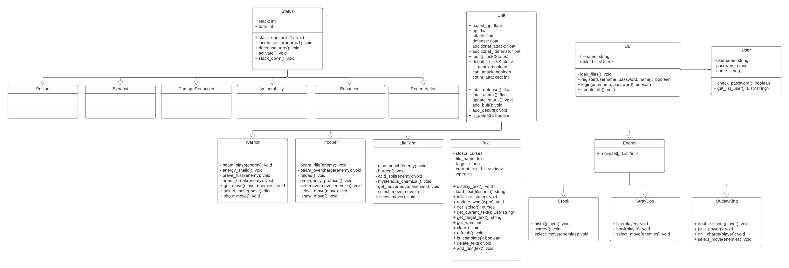

# Typo Space 

## Overview
Typo Space is speed typing game, inspired by [Monkeytype](https://monkeytype.com/). Players will take on the role of space officer 
and face the outlaw. The player must defeat all the outlaw to win the game.

## Features

**User Features**

- User authentication
    - Registration System with username, password and name
    - Login System
    - hash all password with `sha256` to ensure the security of user
- User Session
    - Remember current user when user login or register


**Game Features**
- Turn-based strategy game: Players will expirience a turn-based fight.
- The challenging of the game: Typo Space has three different levels for players. Also player must have WPM at least 30 WPM.
- Text for speed type: The game will random text for player to type.

## Libraries and tools
- [curses](https://docs.python.org/3/howto/curses.html)
- [csv](https://docs.python.org/3/library/csv.html)
- [json](https://docs.python.org/3/library/json.html)
- [hashlib](https://docs.python.org/3/library/hashlib.html)


## Program design

Database will store player’s information after the program ends. Also check if the player has information in the database or not. Clan is the object containing default attributes of characters. Warrior and Trooper are inherited from Clan. When the game starts each player will have their own character. During the game phase, the program will random text to both players to type. After that the program will compute word per minute to determine who wins in those rounds. If the player who has health points lower or equal zero will lose the game and the game will end here. The program will store both user's information in the database.

## Code structure
```
Typo-Space/
├─ data/
│  ├─ clan.json
│  ├─ enemy.json
│  ├─ level.json
│  ├─ user.csv
│  ├─ word.txt
├─ games/
│  ├─ rpg/
│  |  ├─ components/
|  |  |    ├─ clan.py
|  |  |    ├─ enemy.py
|  |  |    ├─ status.py
|  |  |    ├─ unit.py
|  │  ├─ turn_base_rpg.py
│  ├─ type/
│  |  ├─ prototype/
|  |  |    ├─ type_tutorial_prototype.py
|  │  ├─ typing_game.py
|  │  ├─ text.py
├─ user/
│  ├─ db.py
│  ├─ user.py
├─ .gitignore
├─ main.py
├─ README.md
```


